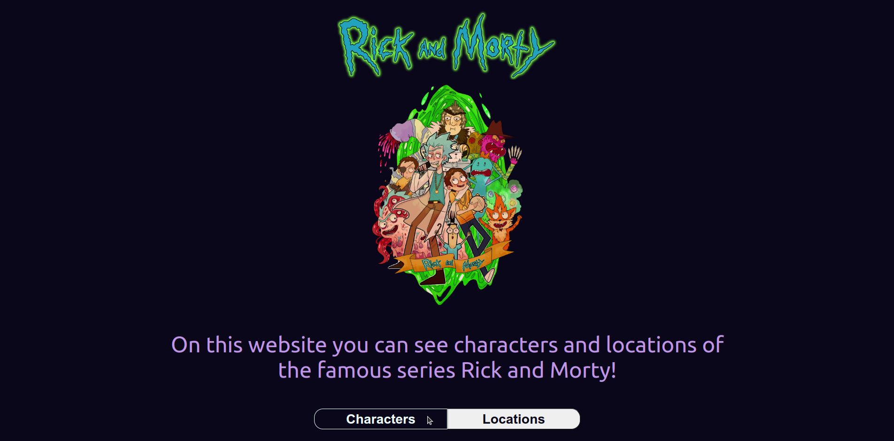
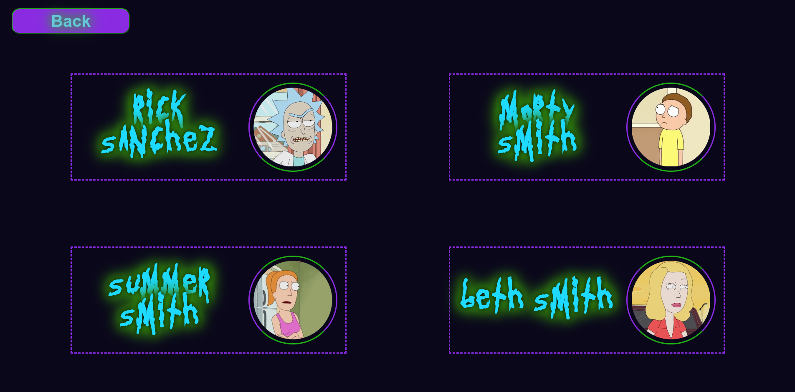
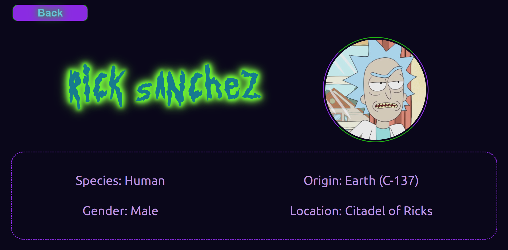
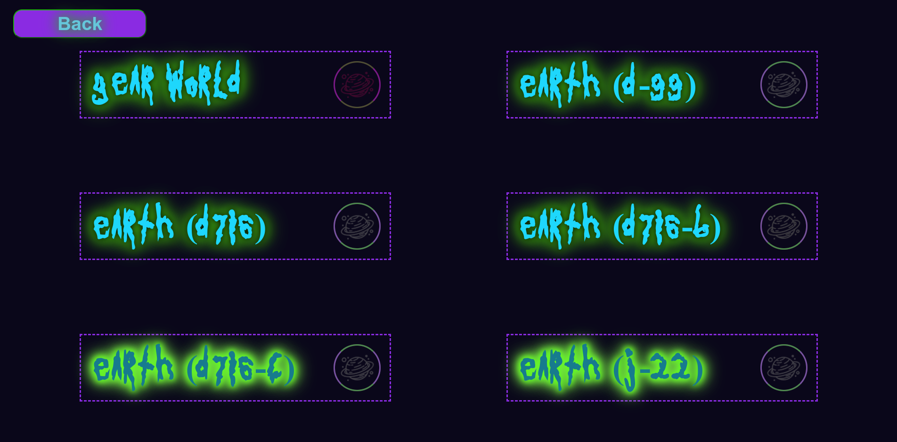
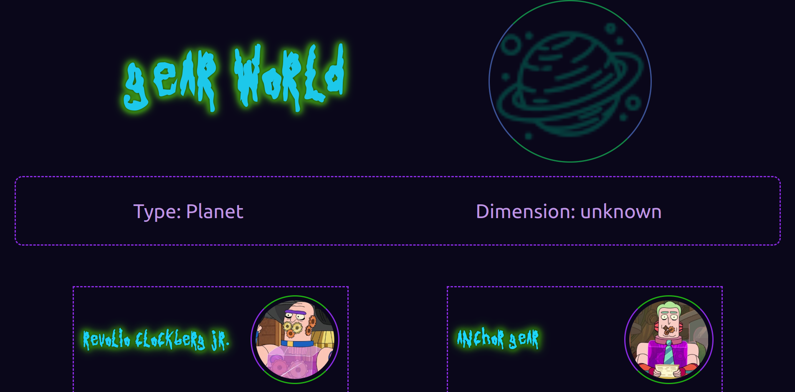

# Rick and Morty React App

This React app allows users to explore characters and locations from the famous series Rick and Morty.

## Features

- **Homepage**: The homepage presents users with a Rick and Morty logo and two buttons to choose between viewing characters and locations.

- **Character List**: Clicking on the "Characters" button takes users to a paginated list of characters. As the user scrolls down, more characters are loaded dynamically from the API.

- **Character Details**: Clicking on a character card takes users to a detailed page about that character. It provides additional information about the character and a back button to return to the character list.

- **Location List**: Similarly, clicking on the "Locations" button leads to a paginated list of locations. More locations load as the user scrolls down.

- **Location Details**: Clicking on a location card shows detailed information about that location. It also displays characters associated with that location and allows users to click on a character to see their details.

## Installation

1. Clone the repository:
    ```sh
    git clone https://github.com/gerigol/react-and-morty-react-gerigol.git
    ```
2. Navigate to the project root directory (where package.json file located):
    ```
    cd react-and-morty-react-gerigol/react-and-morty/
    ```
3. Install dependencies:
    ```
    npm install
    ```
## Usage
1. Start the development server: 
      ``` 
      npm start
      ```
2. Open your browser and navigate to http://localhost:3000 to use the app.

## Acknowledgements
Data provided by the [Rick and Morty API](https://rickandmortyapi.com/).

## Screenshots

 *Homepage of the Rick and Morty React App.*


*List of characters with infinite scrolling.*


*Detailed information about a character.*


*List of locations with infinite scrolling.*


*Detailed information about a location, including associated characters.*

## Future Feature Plans

I have exciting plans for enhancing the Rick and Morty React App in the future. Here are some of the features i'm considering:

- **AI-generated Planet Pictures**: WI'm exploring the possibility of integrating an AI picture generator to create unique and imaginative pictures for each planet in the Rick and Morty universe. This would add a visually captivating element to the app.

- **Character Search and Filtering**: I'm planning to implement a search and filtering functionality for the characters and locations. Users will be able to search for specific characters or apply filters based on attributes such as species, gender, and more.

- **Episode Details**: Adding a section to explore episode details, including summaries, air dates, and associated characters. This will provide a comprehensive view of the series' episodes.

These are just a few of the exciting features we're considering for future updates to the app. Stay tuned for more enhancements!

